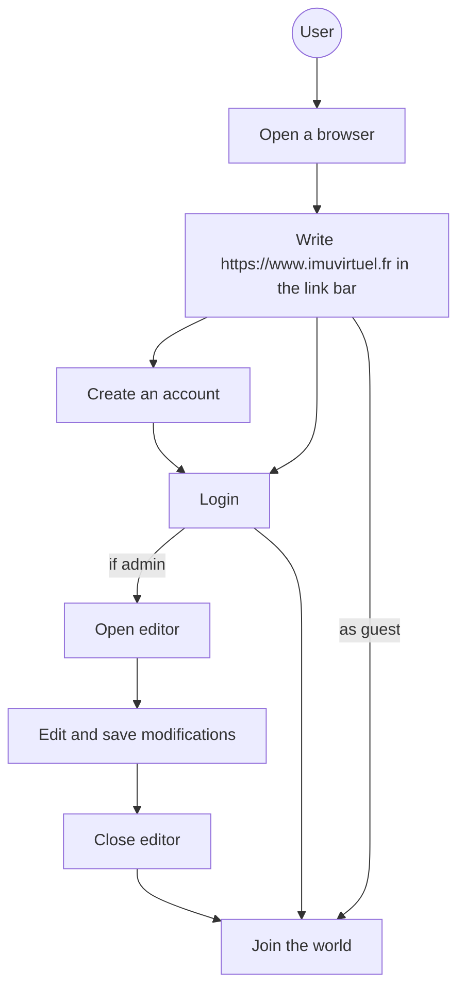
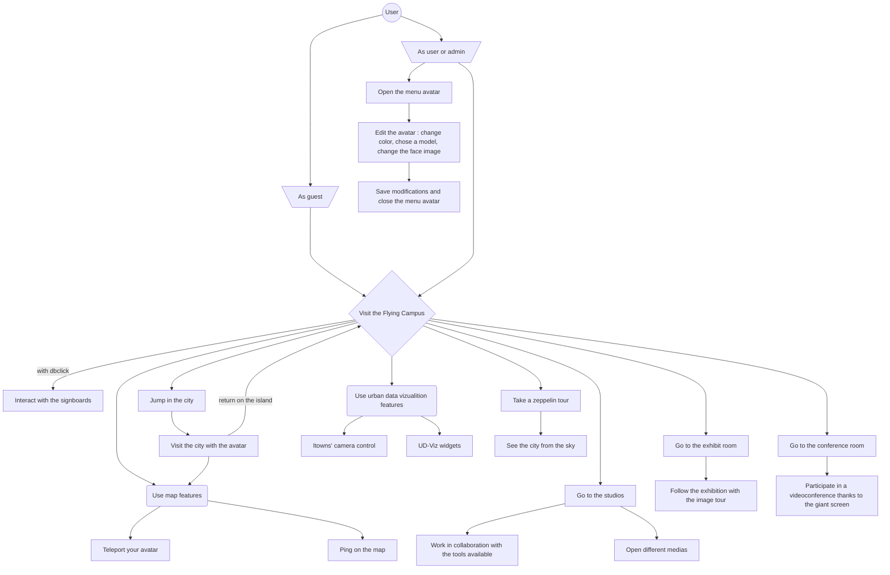

# Features IMUV

## Exhibition

- Exhibition room :

  - Possibility to place pictures on the wall of the room.
  - Follow the exhibition guided (with next / previous button) or freely by moving in the 3D world

- The Island:
  - Possibility to place the interactive panels in the island
  - Link media to the panels (photos / videos / audios / website)

## Communication

- Conference room :

  - Conference room with a large screen allowing for audio / video / text / screen sharing communication tool.

- Communication areas:
  - You can meet in several places in the island and rooms to discuss with other users present in the island.

## Work

- Studios:
  - The studios are workrooms. Access to chat and a collaborative whiteboard.

## Model

- 3D model :
  - Lyon in 3D model
  - Walk around the model (with the 3D avatar)
  - Use the data visualization features of Itowns and UD-Viz :
    - Top-view
    - Interaction wigdets

## Example of use

- Before join the world

- In Game

