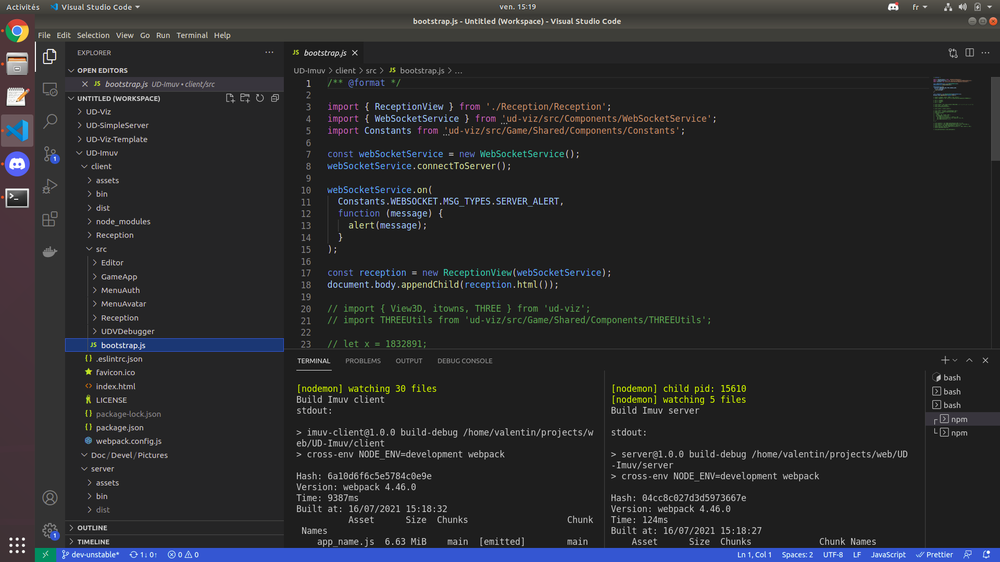

# Imuv

Imuv is a game application builded with the [UD-Viz](https://github.com/VCityTeam/UD-Viz) framework.

`client` is a [front-end](https://en.wikipedia.org/wiki/Front_end_and_back_end) application requiring `server`
its [back-end](https://en.wikipedia.org/wiki/Front_end_and_back_end) node application providing an http server and a websocket communication layer (expecting Imuv client connections),

## Installing the applications
### Pre-requisites

* **Ubuntu**

  * Install and update npm

    ```bash
    sudo apt-get install npm    ## Will pull NodeJS
    sudo npm install -g n     
    sudo n latest
    ```

  * References: [how can I update Nodejs](https://askubuntu.com/questions/426750/how-can-i-update-my-nodejs-to-the-latest-version), and [install Ubuntu](http://www.hostingadvice.com/how-to/install-nodejs-ubuntu-14-04/#ubuntu-package-manager)

* **Windows**
  
  * Installing from the [installer](https://nodejs.org/en/download/)
  * Installing with the [CLI](https://en.wikipedia.org/wiki/Command-line_interface)

    ```bash
    iex (new-object net.webclient).downstring(‘https://get.scoop.sh’)
    scoop install nodejs
    ```
    
## Pre-requisites to install Imuv
Install [imagemagick](https://imagemagick.org/index.php) and [graphicsmagick](http://www.graphicsmagick.org/) binary sub dependencies since the server needs [gm](https://www.npmjs.com/package/gm?activeTab=readme).

* **Linux**
```bash
 sudo apt-get install -y imagemagick graphicsmagick
```
You can also refer to the installation steps with this [Dockerfile](https://github.com/VCityTeam/UD-Viz-demo-docker/blob/main/v2.31.6/Imuv/Dockerfile)

* **Windows**
FIXME: unmature section

If at runtime the imuv server displayed images errors then you should check the installation of thoses binary dependencies. 
> ⚠️ allias `gm` doesn't work in powershell because it conflicts with the command Get-Member !!!!

## Installing Imuv applications

Imuv can be locally (on your desktop) started in the following way:

First install the client:
```
cd ./client
npm install
npm run debug
```

Note that technically the `npm run debug` command will use the [nodemon](https://www.npmjs.com/package/nodemon) npm package that
- launches a watcher (surveying changes in sources)
- in case of change runs this [node.js routine](./Imuv/client/bin/debug.js) that will repack an updated bundle

Then install the server:

```
cd ./server
npm install
npm run debug
```

Note that technically the `npm run debug` command will use the [nodemon](https://www.npmjs.com/package/nodemon) npm package that
- launches a watcher (surveying changes in sources)
- in case of change runs this [node.js routine](./Imuv/server/bin/debug.js) that will repack an updated bundle then launches the node.js server application on your desktop

and then use your favorite (web) browser to open
`http://localhost:8000/`.

## Setup of the coding environment

Installing [Visual Studio Code](https://code.visualstudio.com/) is recommended, in order to use the plugin formatter [Prettier](https://marketplace.visualstudio.com/items?itemName=esbenp.prettier-vscode). Once installed you should setup Prettier with single quote coding style (Preferences => Settings => Type in search bar : Single quote => Toggle single quote of Prettier extension)

### Debugging with UDV library

If you need to code in [UD-Viz-demo](https://github.com/VCityTeam/UD-Viz-demo) and [UD-Viz](https://github.com/VCityTeam/UD-Viz) library you should clone the two repositories side by side on your disk. Then in the package.json of the demo you want to link with UD-Viz library :

```
"ud-viz": "^2.31.9" => "ud-viz": "file:../../../UD-Viz" //where the path is a relative path to your UD-Viz directory
```

then reinstall the ud-viz npm package

```
npm install ud-viz
```

Note that when you make a change in UD-Viz library watchers of UD-Viz-demo will not notice it, you have to restart it yourself by typing "rs" in the watcher console.

### Workflow

In VS Code you can open terminal here is the possible layout:

Imuv:


Before to push your modifications run:
```
npm run travis
```
to check if eslint and the webpack command run well
