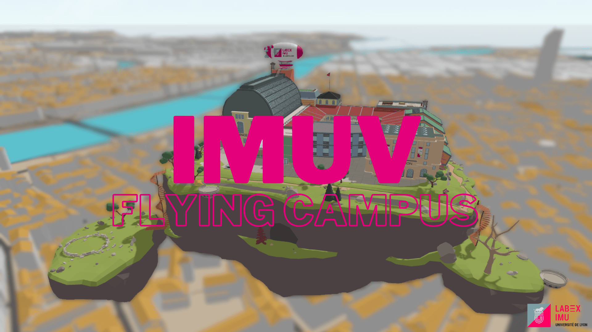

# IMUV - Flying Campus


Online demo : https://www.imuvirtuel.fr/.

IMUV is a game application built on the [UD-Viz](https://github.com/VCityTeam/UD-Viz) framework.

## A client-server application
`client` is a [front-end](https://en.wikipedia.org/wiki/Front_end_and_back_end) application requiring `server`. Its [back-end](https://en.wikipedia.org/wiki/Front_end_and_back_end) node application providing an http server and a websocket communication layer (expecting Imuv client connections).

## REPOSITORIES GITHUB

| Repository       | Link                                          | Description                                                                                                                                     |
| ---------------- | --------------------------------------------- | ----------------------------------------------------------------------------------------------------------------------------------------------- |
| UD-Viz           | https://github.com/VCityTeam/UD-Viz           | Javascript framework for urban data visualization.                                                                                              |
| UD-Imuv-Docker   | https://github.com/VCityTeam/UD-Imuv-docker   | Docker image for the IMUV server.                                                                                                               |
| UD-Demo-IMU-Imuv | https://github.com/VCityTeam/UD-Demo-IMU-Imuv | Docker-compose file to run IMUV and services it depends on for some features. (Authentification, Editor, Whiteboard, chat audio/video/text ...) |

## Pre-requisites to install IMUV

### Install node/npm

For the npm installation refer [here](https://github.com/VCityTeam/UD-SV/blob/master/Tools/ToolNpm.md)

UD-Imuv has been reported to work with versions:

- node version 18 
- npm version: 9

### Install ImageMagick and GraphicsMagick

For the install [imagemagick](https://imagemagick.org/index.php) and [graphicsmagick](http://www.graphicsmagick.org/) binary sub dependencies since the server needs [gm](https://www.npmjs.com/package/gm?activeTab=readme).

- **Linux**

```bash
 sudo apt-get install -y imagemagick graphicsmagick
```

- **Windows**
  - It seems not necessary to install imagemagick on windows.
  - Download and install graphicsmagick from [graphicmagick-binaries](https://sourceforge.net/projects/graphicsmagick/files/graphicsmagick-binaries/) (IMUV has been reported to work with version 1.3.34-Q8)

> ⚠️ TIP : allias `gm` doesn't work in powershell because it conflicts with the command Get-Member !!!!

If at runtime the imuv server displayed images errors then you should check the installation of thoses binary dependencies.

### Install Parse-Server and MongoDB (optionnal)

For certain features (**authentification**, **editor**, **menu avatar**...), Imuv requires a parse-server. It stores the **user accounts** and the **user's data**.

Self-hosting :

- You can clone the repo of the docker-compose [UD-Demo-IMU-Imuv
  ](https://github.com/VCityTeam/UD-Demo-IMU-Imuv) and follow the instructions to install the parse-server and the mongoDB database:
  - Set-up environment variables in **UD-Demo-IMU-Imuv** : `cp env-default .env` and edit the `.env` file. (Put default proposed values in PARSE_SERVER_URL and MONGO_HOST).
  - Run `docker-compose up -d parse-server mongodb` to start the parse-server and the mongoDB database.

OR

- You can find docker image and read doc [here](https://hub.docker.com/r/parseplatform/parse-server).

### Set the environment variables

You can set the environment variables in a `.env` file:

- `cp env-default .env`
- edit the `.env` file. (Make sure to set the correct value for the `PARSE_APP_ID` and `PARSE_MASTER_KEY` variables)

| VARIABLES             | DESCRIPTION                                                                                                                                                                               |
| --------------------- | ----------------------------------------------------------------------------------------------------------------------------------------------------------------------------------------- |
| PARSE_SERVER_URL      | URL of your parse-server (ex: http://localhost:1337/parse ; cf https://github.com/VCityTeam/UD-Imuv#install-parse-server-and-mongodb-optionnal)                                           |
| PARSE_APP_ID          | Application ID of your parse-server. This will be used by imuv server to authenticate with the parse-server.                                                                              |
| PARSE_MASTER_KEY      | Master key of your parse-server. This will be used by imuv server to authenticate with the parse-server.                                                                                  |
| JITSI_PUBLIC_URL      | URL of the jitsi server. You can use the dev serv https://meet.jit.si or install your own jitsi server with [docker-compose](https://github.com/VCityTeam/UD-Demo-IMU-Imuv)               |
| WBO_PUBLIC_URL        | URL of the whitebophir server. You can use the dev serv https://wbo.ophir.dev or install your own whitebophir server with [docker-compose](https://github.com/VCityTeam/UD-Demo-IMU-Imuv) |
| PORT                  | Server port number                                                                                                                                                                        |
| JSON_WEB_TOKEN_SECRET | Token for authentication features (sign in / sign up). cf  https://fr.wikipedia.org/wiki/JSON_Web_Token                                                                                   |

## Launch Imuv applications

Imuv can be locally (on your desktop) started in the following way:

```
npm install
npm run `start`
```

and then use your favorite (web) browser to open
`http://localhost:8000/` (8000 or PORT which is specified in .env).


## Setup of the coding environment

Installing [Visual Studio Code](https://code.visualstudio.com/) is recommended, to use the plugin format [Prettier](https://marketplace.visualstudio.com/items?itemName=esbenp.prettier-vscode).

## Dev in Imuv

There are main 4 commands to dev in Imuv.

Bundles commands: `dev-game`, `dev-utils`, `dev-editor`.
Server command: `dev-backend`.


> Note that technically all the `npm run dev-xxx` commands will use the [nodemon](https://www.npmjs.com/package/nodemon) npm package that
> - launches a watcher (surveying changes in sources)
> - in case of change runs this node.js routine that will repack an updated bundle


### Debugging with UDV library

If you need to code in [UD-Viz-demo](https://github.com/VCityTeam/UD-Viz-demo) and [UD-Viz](https://github.com/VCityTeam/UD-Viz) library you should clone the two repositories side by side on your disk. Then in the package.json of the demo you want to link with UD-Viz library :

```
"ud-viz": "^2.31.9" => "ud-viz": "file:../../../UD-Viz" //where the path is a relative path to your UD-Viz directory
```

then reinstall the ud-viz npm package

```
npm install ud-viz
```

Note that when you make a change in UD-Viz library watchers of UD-Viz-demo will not notice it, you have to restart it yourself by typing "rs" in the watcher console.

### Workflow

Before to push your modifications, check check if your code respect eslint rules and if your application build correctly. For that you can use the following command:

```
npm run travis
```
