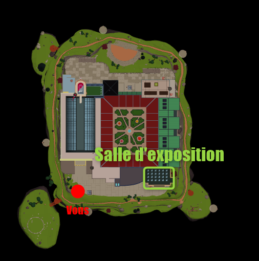
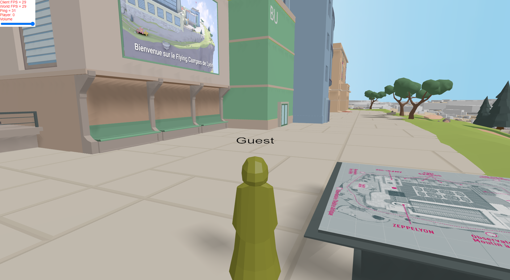
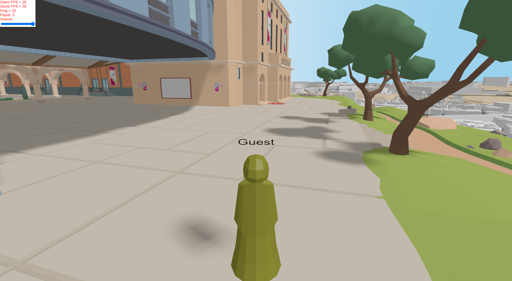
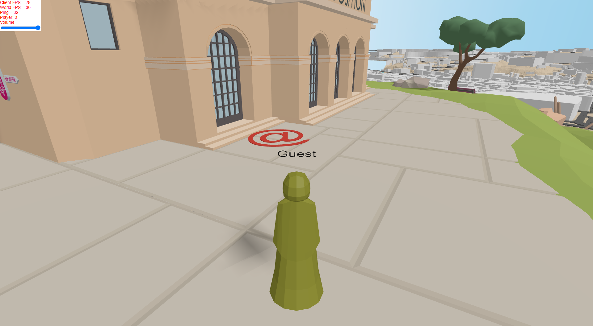
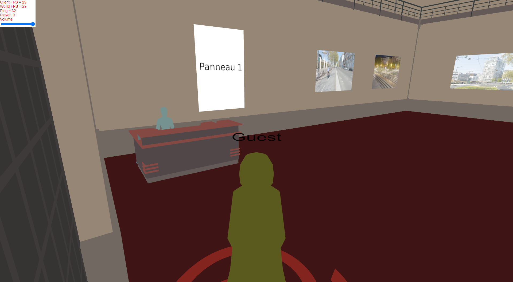
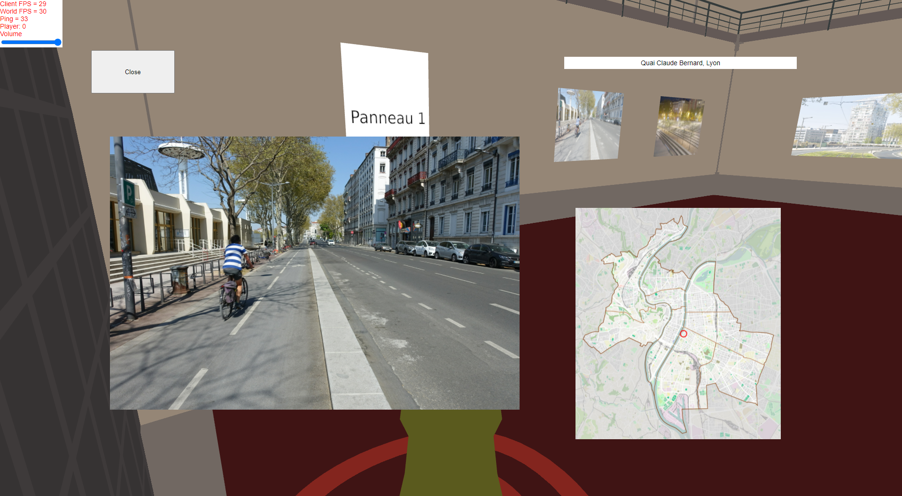

# Salle d'exposition

_La salle d’exposition est un lieu d’échange sur une exposition virtuelle de photos et de visuels urbains. Des chaises et des tabourets sont disposés dans la salle afin de pouvoir discuter à l’aide d’un tchat vocal intégré au jeu._

### La salle d'exposition se trouve ici sur la carte :

## Pour rentrer dans la salle d'exposition, il faut se déplacer sur l'**arobase rouge** (Image 3) qui se trouve devant la salle.

### Suivis en images du trajet : 

## Vous voici dans la salle d'exposition.

Pour ouvrir les informations suplémentaires et les photos en grand :

- **Double cliquer** sur une **_image_** ou sur un **_panneau_** pour ouvrir un popup

Example de POPUP :

