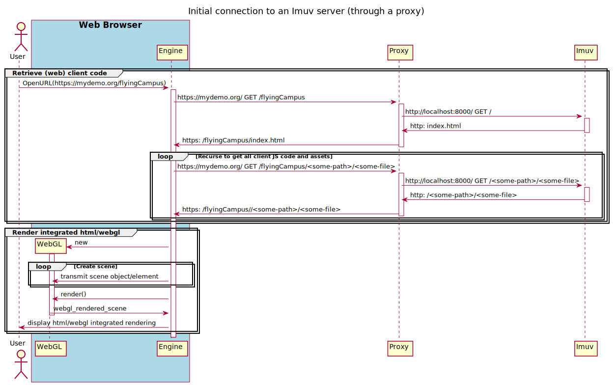
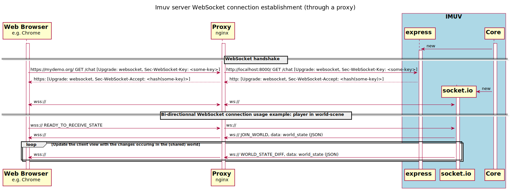

# Diagrams

## Authoring pre-requisites

The [PlantUML](https://en.wikipedia.org/wiki/PlantUML) diagrams (files with a `.puml` extension)
will require the `plantuml` cli utility for their rendering.

### The docker way

If you have [docker](<https://en.wikipedia.org/wiki/Docker_(software)>) installed on your host,
then you can use `plantuml` through e.g. the
[dockerhub's dstockhammer/plantuml image](https://github.com/dstockhammer/docker-plantuml).
For example you might run (refer to the [makefile](./makefile))

```bash
docker run --rm -v $(shell pwd):/work -w /work -t dstockhammer/plantuml  -Tsvg client-imuv_server-websocket-handshake-trough-proxy.puml
```

refer to the manual with

```bash
docker run --rm -t dstockhammer/plantuml -help
```

### The package way

On OSX, and with brew the following install should provide you with `plantuml` command

```bash
brew install --cask temurin         # For Java
brew install graphviz               # Used by plantuml for some diagrams
brew install plantuml
```

### Within the [VScode](https://en.wikipedia.org/wiki/Visual_Studio_Code) IDE

You might consider installing e.g. [jebbs PlantUML](https://marketplace.visualstudio.com/items?itemName=jebbs.plantuml) extension.

## Authoring cycle

Once a plantuml source is edited, you will need to generate/update the associated
[svg](https://en.wikipedia.org/wiki/Scalable_Vector_Graphics) file.
If you have both [docker](<https://en.wikipedia.org/wiki/Docker_(software)>) and
[make](<https://en.wikipedia.org/wiki/Make_(software)>) installed on your host then launching
the `make` command should suffice to do the trick.

## Resulting images




