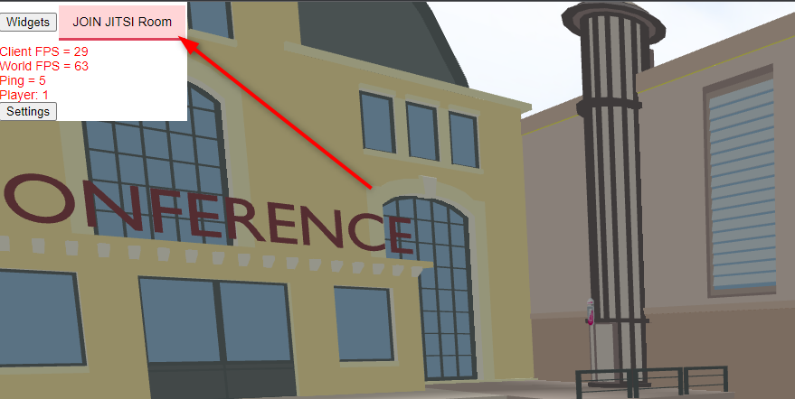
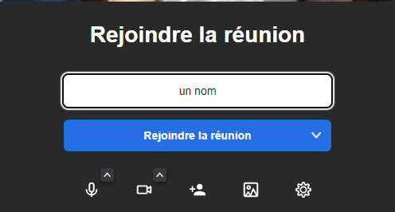
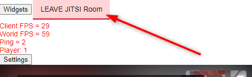

# Chat (Jitsi)

Une application de visio est implémenté dans IMUV. Il y a **une salle par *monde*¹**

## Les étapes :

- ### Autoriser l'utilisation de périphérique audio et vidéo par votre navigateur

  

- ### Cliquer sur le bouton "Join Jitsi Room"

  

- ### Saisir un nom et cliquer sur Rejoindre la réunion

  

- ### Enfin quitter la salle de visio grâce au bouton "Leave Jitsi Room"

  

> **¹** Un monde correspond à un des espaces accessible sur l'ile (le flying campus, salle de conférence, salle d'exposition...)
