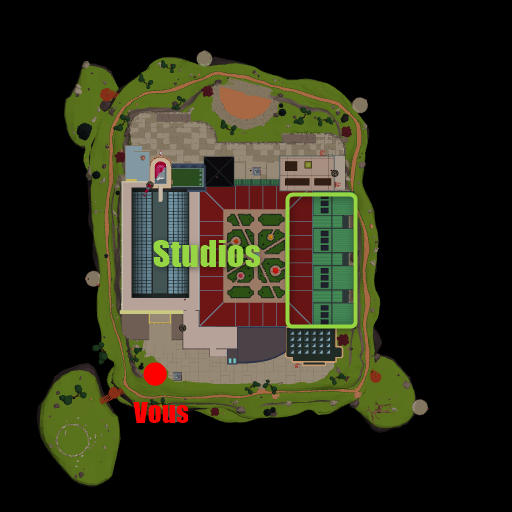
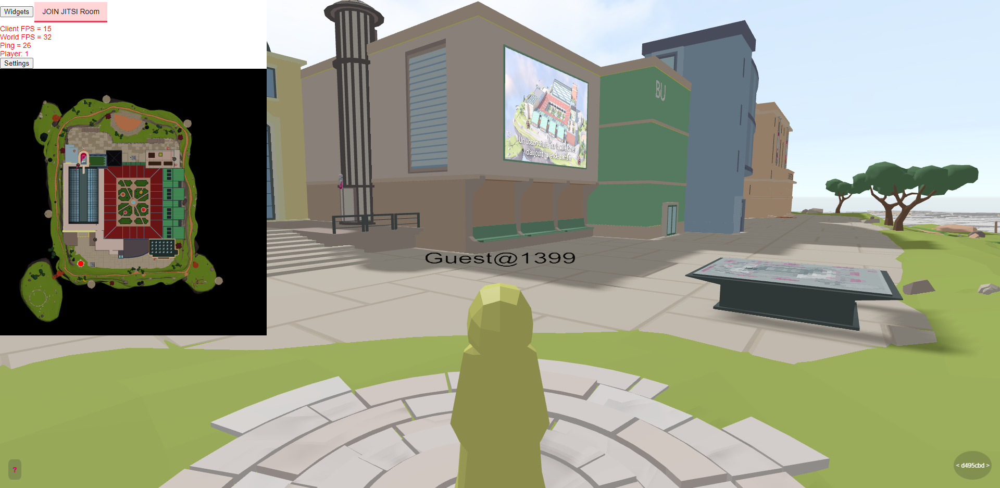
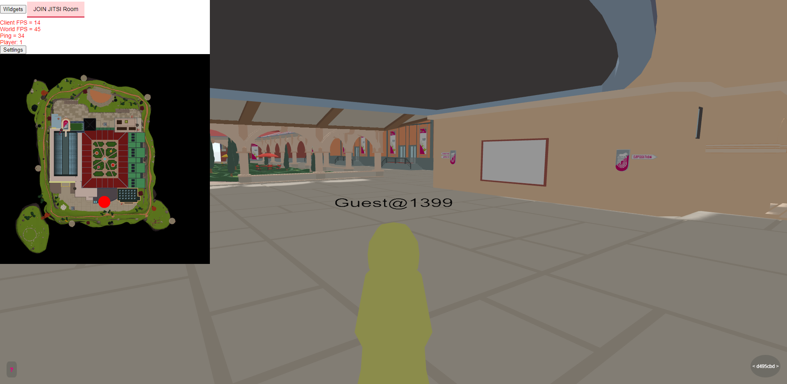
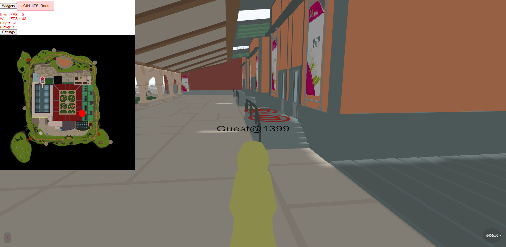
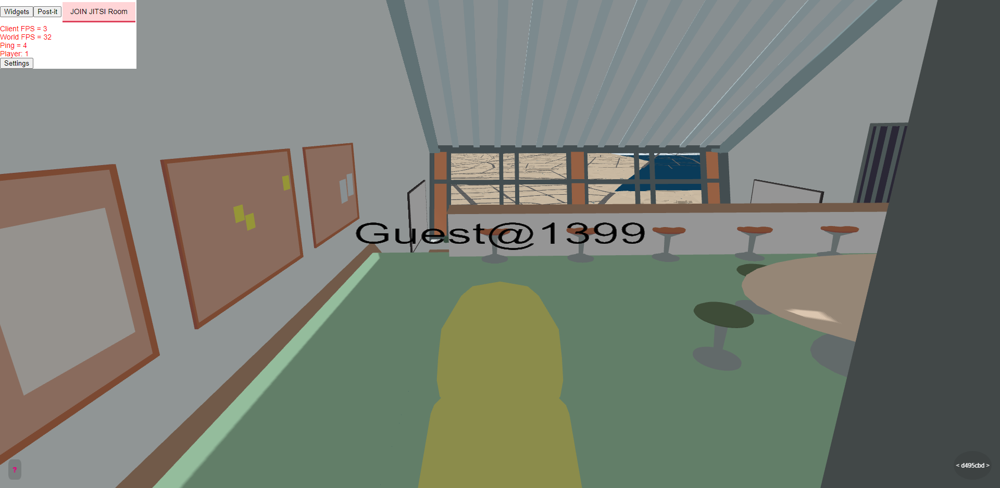
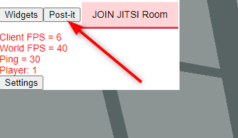
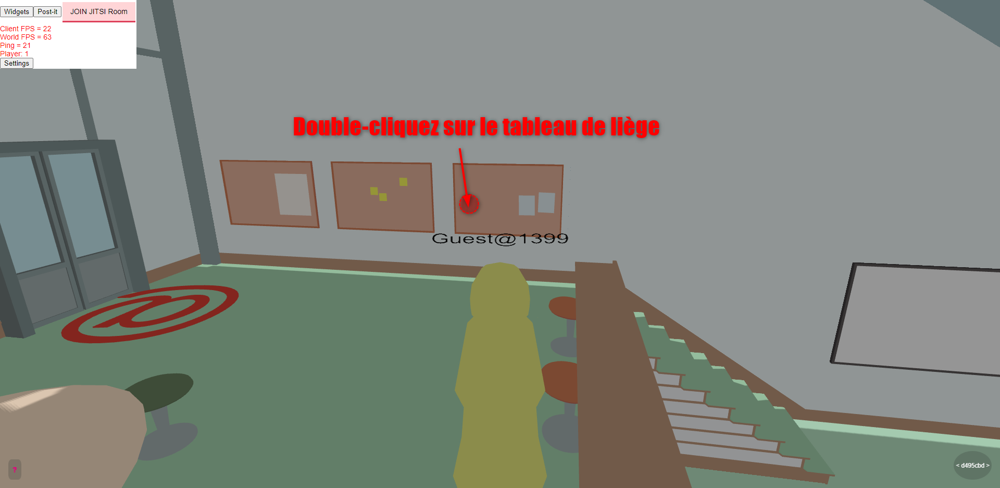
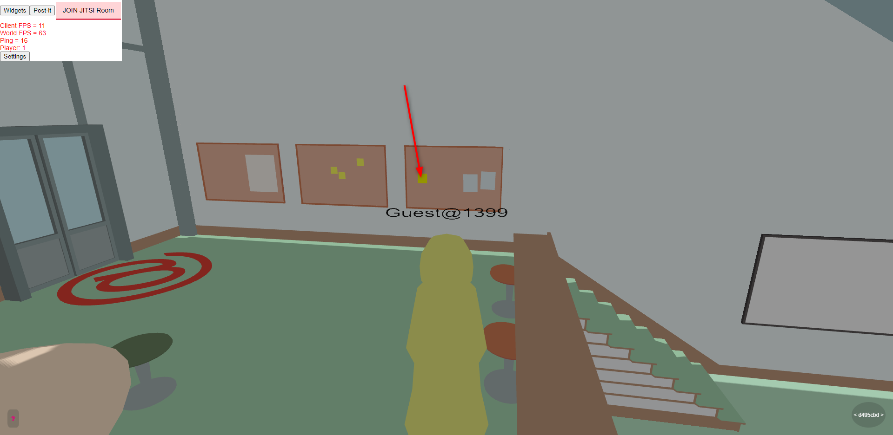
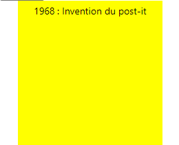

# Post-It

### Pour utiliser un post-it il faut se rendre dans un des studios.

## Pour rentrer dans un studio, il faut se déplacer sur l'**arobase rouge** (Image 3) qui se trouve devant la salle.

### Suivis en images du trajet : 

Un fois dans la salle vous pouvez voir un nouveau bouton dans l'interface se nommant "post-it".

Pour poser un post-it utiliser le bouton pour choisir un endroit où le poser

Pour choisir l'endroit où le post-it et ouvrir le menu de création double-cliquez sur un tableau ou sur un mur

Un menu de création de post-it dans l'ui vous pouvez maintenant écrire ce que vous voulez exposer dans la salle et ensuite cliquer sur créer.

Le post-it est maintenant visible dans la scene 3D

Pour lire un post-it double-cliquez dessus.

