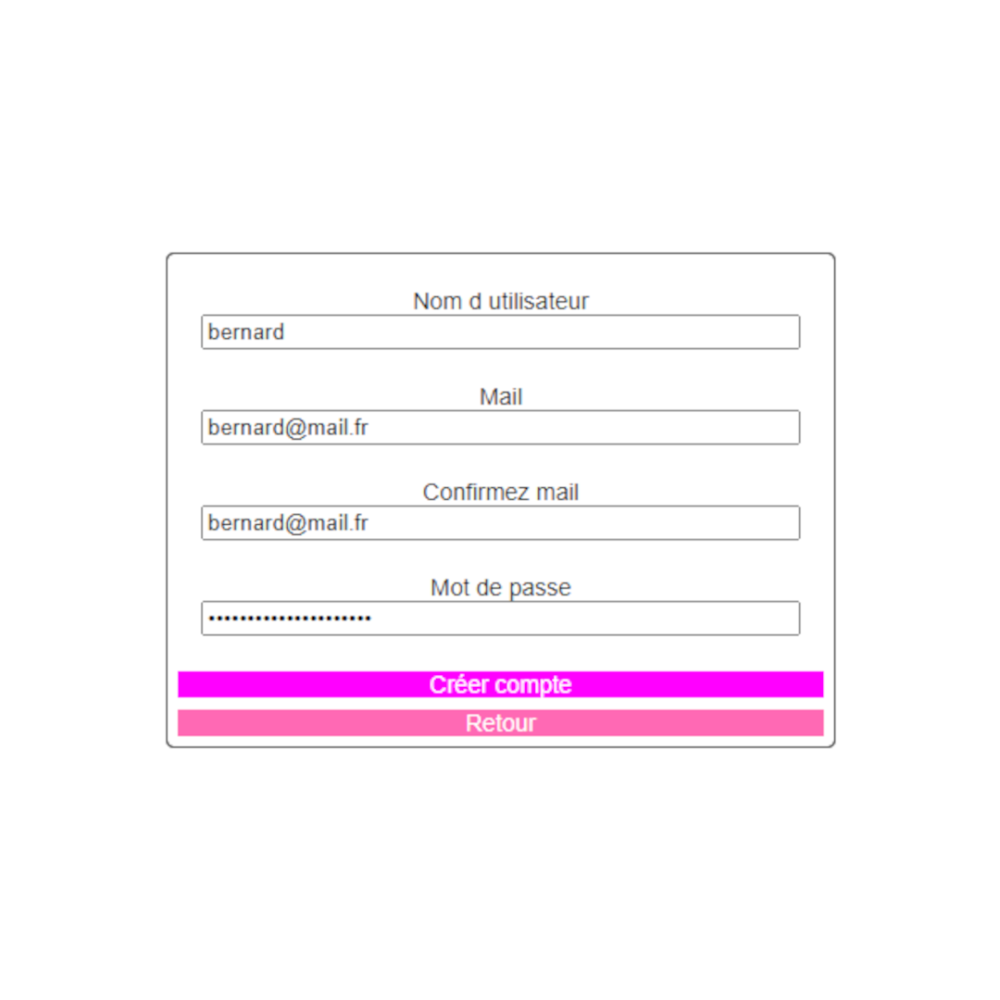
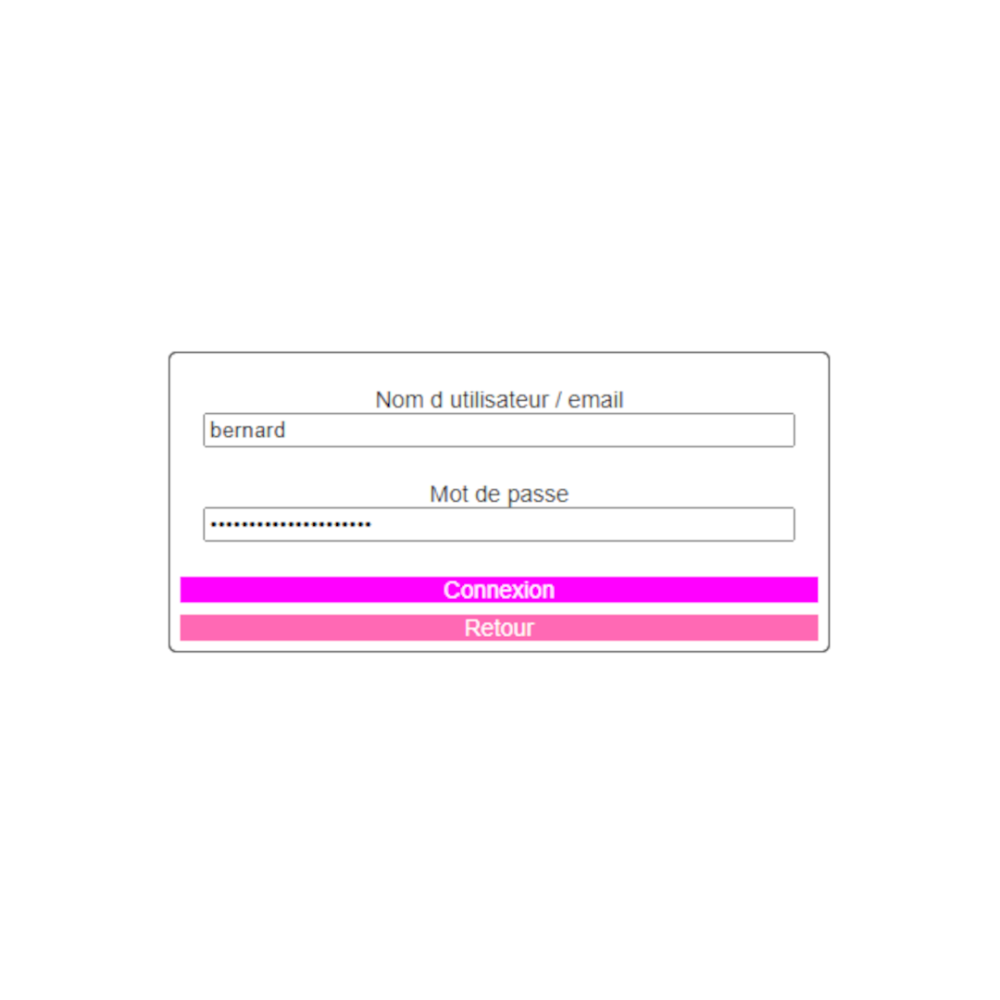

# Compte

## Créer un compte

## S'identifier

## Rôles

Il existe trois rôles dans IMUV qui occtroies des fonctionnalités différentes :

|                                                                | GUEST | USER | ADMIN |
| -------------------------------------------------------------- | ----- | ---- | ----- |
| Fonctionnalité de bases (Rejoindre l'ile, Chat, Exposition...) | ✔️     | ✔️    | ✔️     |
| Nom personalisé                                                | ❌     | ✔️    | ✔️     |
| Menu Avatar                                                    | ❌     | ✔️    | ✔️     |
| Editeur                                                        | ❌     | ❌    | ✔️     |

> Les demandes pour devenir admin se font par mail avec l'addresse qui vous a servi à la création du compte. Addressez à fcimuv@gmail.com.
