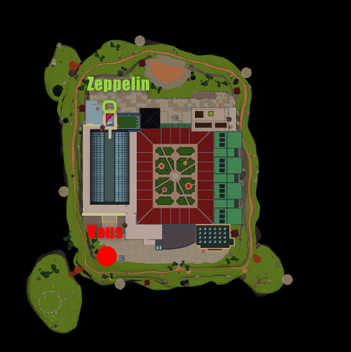
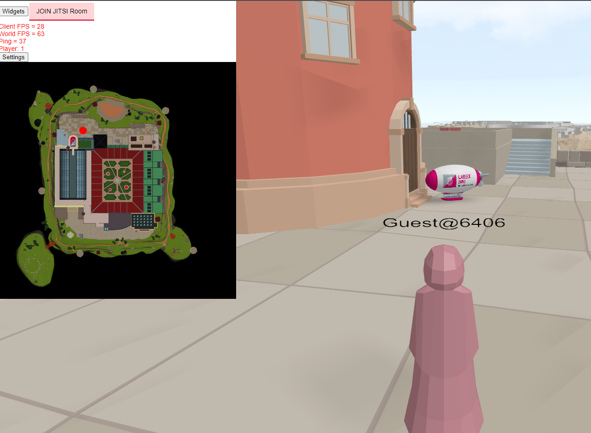
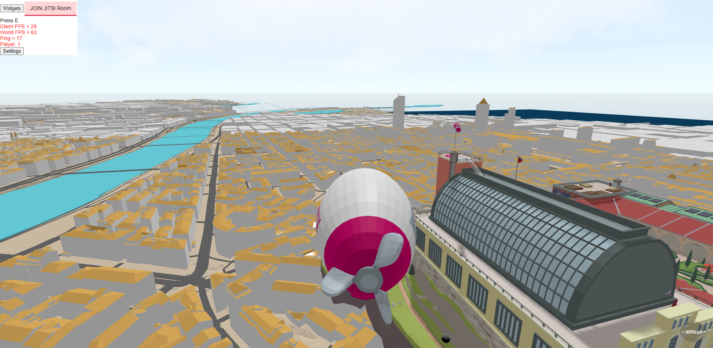

# Zeppelin Tour

Vous pouvez conduire un zeppelin pour survoler la ville. Pour cela diriger vous ici :

Pour finir appuyer sur la touche d'action (**E**) pour rentrer dans le zeppelin

Pour contrôler le zeppelin, les touches sont les mêmes que pour l'avatar à l'exception faite que les mouvements latéraux sont remplacé par une rotation de l'engin.
